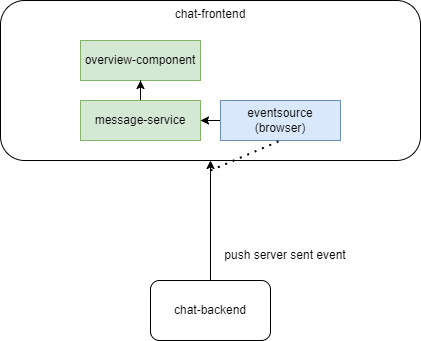

# ChatStreamReactive

## Sind und Zweck
* Demoprogramm für den Umgang mit ServerSentEvents (SSE)
* Stellt mittels reactivem Stack SSEs von Chatnachrichten bereit
* Details im `MessageController.java`

## Bausteinsicht

## Lokal ausführen
* `mvn clean package`
* `java -jar target\chatstream-reactive-0.0.1-SNAPSHOT.jar`
